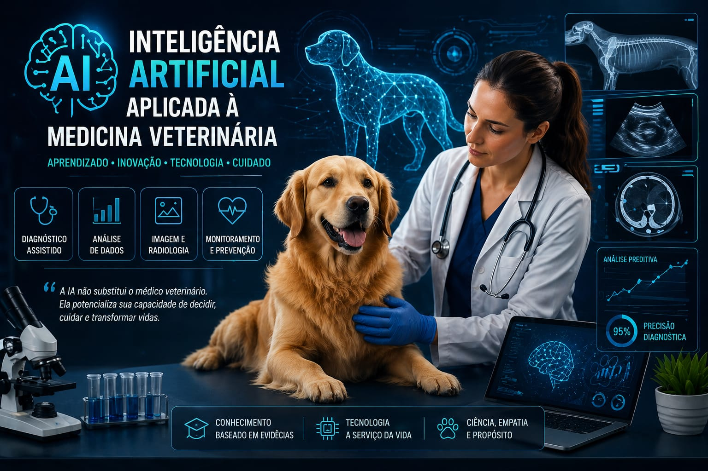

<p align="center">
  
</p>

<h1 align="center">🧠 Inteligência Artificial Aplicada à Medicina Veterinária</h1>
<p align="center">
  
  
  
</p>
<p align="center">
🚀 Caderno Temático com NotebookLM
</p>

---
<p align="center">
Transformando conhecimento clínico em decisões mais inteligentes com Inteligência Artificial
</p>

---

## 📌 Sobre o Projeto

Este projeto explora o uso da Inteligência Artificial como ferramenta de aprendizagem ativa, suporte ao raciocínio clínico e tomada de decisão na Medicina Veterinária.

Através do NotebookLM, foi desenvolvido um caderno temático estruturado, baseado em curadoria de fontes científicas e aplicação de engenharia de prompts.

---

## 🎯 Objetivos

* 🧠 Integrar IA ao processo de estudo clínico
* 🔍 Desenvolver pensamento crítico sobre respostas da IA
* ⚙️ Aplicar engenharia de prompts de forma estratégica
* 📊 Criar um sistema de aprendizagem reutilizável (segundo cérebro)
* 🩺 Explorar aplicações reais da IA na prática veterinária

---

## 🧠 Estrutura do Projeto

```
📁 caderno-ia-veterinaria
 ├── README.md
 ├── 📁 fontes
 ├── 📁 resumos
 ├── 📁 prompts
```

---

## 📚 Curadoria de Fontes

### 🩺 Aplicações Clínicas e Diagnóstico

* A Revolução da Inteligência Artificial no Diagnóstico Veterinário
* Inteligência Artificial em Radiologia Veterinária e Diagnóstico por Imagem
* Inteligência Artificial em Patologia Clínica Veterinária
* Inteligência Artificial e Análise Preditiva na Medicina Veterinária
* Saúde Animal e IA

### 🔬 Estudos Científicos

* Pontuação de aprendizado de máquina para previsão de bacteremia - ImpriMed
* Tendências Futuras na Medicina Veterinária Assistida por IA - PMC

### 🚀 Mercado e Inovação

* Startups brasileiras de IA 2026
* Tecnologias para animais de estimação 2024 - Liga Ventures
* Relatório de mercado de IA para saúde animal

### ⚠️ Riscos e Erros Diagnósticos

* Erros comuns no diagnóstico veterinário
* Falhas em laudos veterinários
* Lacuna regulatória na IA veterinária

---

## ⚙️ Engenharia de Prompts

### 🔹 Prompt Estratégico

Analise o uso de IA no diagnóstico veterinário comparando com o raciocínio clínico tradicional, incluindo vantagens, limitações e riscos.

### 🔹 Prompt Avançado

Com base nas fontes fornecidas, identifique vieses e erros comuns no uso de IA em diagnósticos veterinários.

### 🔹 Especialista

Atue como especialista em Medicina Veterinária e IA. Estruture uma análise clínica completa com base em dados fornecidos.

---

## 📘 Miniguia de Estudo

### 🧠 Visão Geral

A Inteligência Artificial atua como suporte ao raciocínio clínico, auxiliando na análise de dados e identificação de padrões.

---

### ⚙️ Aplicações

* Diagnóstico assistido
* Análise de exames laboratoriais
* Interpretação de imagens
* Triagem clínica
* Monitoramento de pacientes

---

### 📊 Vantagens

* Maior precisão
* Redução de erros
* Agilidade
* Suporte à decisão

---

### ⚠️ Limitações

* Dependência de dados
* Vieses
* Falta de contexto clínico

---

### 🚨 Riscos

* Diagnósticos incorretos
* Uso inadequado da IA
* Confiança excessiva

---

## 🧩 Prompts Reutilizáveis

* Explique [tema] em nível básico e avançado
* Quais são aplicações práticas de [tema]?
* Compare [conceito A] vs [conceito B]
* Quais erros podem ocorrer nesse diagnóstico?

---

## 🩺 Caso Clínico Simulado

**Paciente:** Cão com vômito, apatia e leucocitose

**Uso da IA:**

* Sugestão de diagnósticos diferenciais
* Análise de exames
* Apoio na decisão clínica

---

## 🚀 Insights Estratégicos

A IA não substitui o médico veterinário — ela potencializa sua capacidade de decisão.

---

## 📡 Futuro da Medicina Veterinária

* Diagnóstico preditivo
* Medicina personalizada
* Integração com dispositivos inteligentes
* Automação clínica

---

## 👩‍💻 Autora

**Tainã Sichero Dulcetti**
Médica Veterinária | Especialista em IA | Criadora de conteúdo

---

## ⭐ Conclusão

Este projeto demonstra como a Inteligência Artificial pode ser utilizada não apenas como ferramenta, mas como amplificador de aprendizado e inteligência clínica.

---

---
